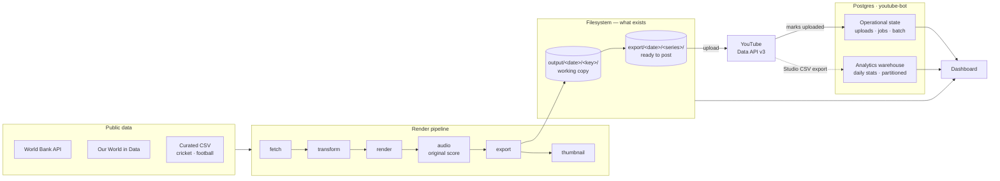
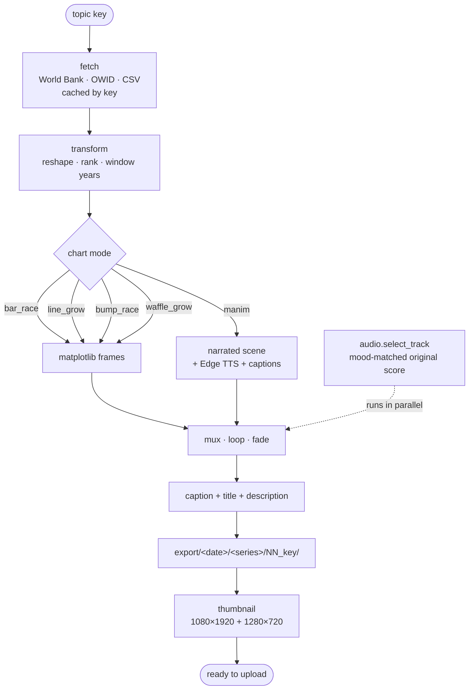
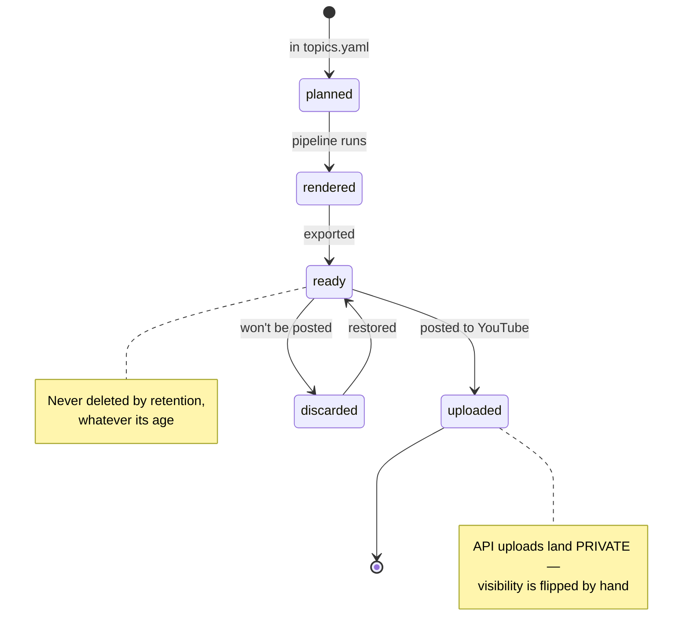
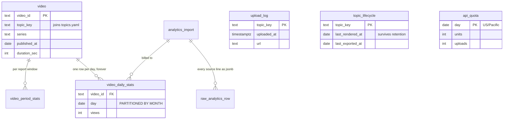
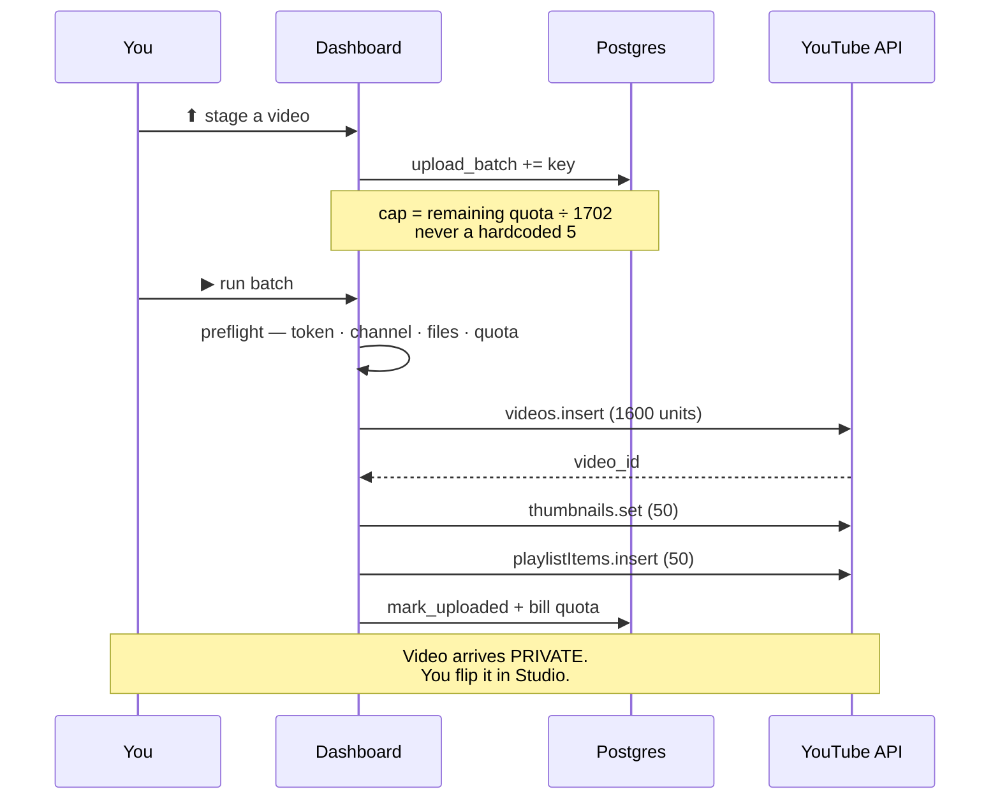

# graph_bot

Generates **animated statistics videos** (vertical, 1080×1920) from free public data, then
tracks, uploads and measures them — the whole loop from "what should I make" to "how did it
do", for the YouTube Shorts channel *Data in Motion*.

Two ways to drive it: a **CLI** for every step, and a **mission-control dashboard** at
`localhost:8787` that wraps the same code.

```bash
py -3 -m venv .venv
.\.venv\Scripts\python.exe -m pip install -r requirements.txt
.\.venv\Scripts\python.exe -m dashboard.server        # → http://127.0.0.1:8787
```

`ffmpeg` comes from the pip package `imageio-ffmpeg` — no system install needed.

**Desktop shortcut:** `.\scripts\make_shortcut.ps1` puts *Data in Motion* on the desktop.
Double-clicking it runs `scripts\launch_app.ps1`, which rebuilds the frontend bundle if
`dashboard/frontend` is newer than `dashboard/static`, starts the backend and opens the
browser. Add `-Dev` for a Vite dev server with hot reload on 5173, or `-Stop` to kill an
app left running in the background.

---

## How it fits together



**The split that matters:** the *filesystem* answers "is there a file I can play or post?".
*Postgres* answers "what happened — what was rendered, uploaded, discarded, measured".
Neither mirrors the other, so they cannot drift.

---

## The render pipeline

Every video walks the same path. The dashboard runs it as a parallel job — music selection
starts before the render finishes, because the track only needs an estimated duration.



Chart modes live in [`render.py`](graph_bot/render.py); narrated scenes are Manim classes in
[`graph_bot/scenes/`](graph_bot/scenes/), registered in `scenes/__init__.py` and selected by a
topic's `scene:` key.

---

## Video lifecycle

A topic moves through states that the dashboard derives rather than stores:



---

## The dashboard

React 18 + Vite in `dashboard/frontend/`, built into `dashboard/static/` (committed), served
by FastAPI — so running it needs **no Node**.

| Screen | What it does |
|---|---|
| **Mission** | Live status only: render orchestrator, upload transmission arc, jobs, telemetry, playlists |
| **Launch Control** | Plan a render batch — strategy, scope, per-topic detail, impact preview |
| **Upload Control** | Stage a batch, preflight it, send it; the upload queue lives here |
| **Analytics** | Channel trend, median views by playlist, length vs reach, top videos |
| **Upload History** | Every uploaded video, newest first, with links |
| **Topic Catalog** | Every topic and its lifecycle phase |
| **Build Next** | Curated, pre-verified topic suggestions grouped by playlist |
| **Music Library** | Tracks by mood, upload / preview / remove |
| **Job History** | Per-agent step timelines and failure details |
| **Settings** | Channel + playlist copy, brand assets, disk retention |

```bash
cd dashboard\frontend
npm install      # first time only
npm run dev      # :5173, proxies /api to :8787
npm run build    # writes the bundle into dashboard/static
```

---

## Data model



`video_daily_stats` is **partitioned by month from the first row** — it is the only table
that grows without bound, because every published video adds a row every day forever. At one
video a day that is 1.7 M rows by year five; at ten a day with traffic-source breakdowns it
is over 100 M. Retrofitting partitioning later is a painful migration; doing it at zero rows
is free.

`raw_analytics_row` keeps every imported line verbatim. YouTube's export columns vary between
downloads — one export carries watch-time and CTR, another carries average-view-duration —
so a metric nobody modelled today stays recoverable tomorrow.

---

## Upload



**Hard constraint:** the Google Cloud project is unverified, so API uploads are locked to
Private and cannot be published programmatically. Lifting it requires the YouTube API
Services audit. Everything else — file, title, description, tags, thumbnail, playlist, and
the upload record — is automated.

**Quota:** one full upload costs 1,702 of 10,000 daily units, so **5 uploads/day**. The quota
resets at midnight US Pacific, and the app tracks it.

```bash
.\.venv\Scripts\python.exe -m graph_bot.publish.auth            # authorise (browser)
.\.venv\Scripts\python.exe -m graph_bot.publish.auth --status   # scopes + which channel
.\.venv\Scripts\python.exe -m graph_bot.publish.upload --key patents --dry-run
```

The uploader refuses to run against the wrong channel: the Google account also owns a
personal channel, the OAuth chooser offers it first, and a wrong-channel token looks
completely valid. The expected channel is pinned in `config/settings.yaml`.

---

## Analytics

YouTube Studio only retains rolling windows, so the exports in `analytics_data/` are the only
long-term history that will ever exist.

```bash
.\.venv\Scripts\python.exe -m graph_bot.analytics init      # create the schema
.\.venv\Scripts\python.exe -m graph_bot.analytics import    # load analytics_data/*.zip
.\.venv\Scripts\python.exe -m graph_bot.analytics status
```

Imports are idempotent — the same zip, or an overlapping range, can be loaded any number of
times. Where two exports disagree about a day (YouTube revises recent figures), the export
whose window ends later wins. **Integrity check after any import:**
`sum(channel_daily_stats.views)` should equal `channel_period_stats.views`.

---

## Retention

Durations run from a **lifecycle event**, never from the folder's date, and anything not yet
uploaded is never deleted at any age — the channel produces faster than it posts, so an old
staged video is a backlog item, not an abandoned one.

```yaml
retention:
  output_days_after_export: 7    # working copies, once exported
  export_days_after_upload: 30   # finished videos, once live
  stale_warn_days: 60            # warn only, never delete
```

```bash
.\.venv\Scripts\python.exe -m graph_bot.retention plan    # dry run (default)
.\.venv\Scripts\python.exe -m graph_bot.retention apply
```

Deleting `output/` is only safe because `topic_lifecycle` remembers what was rendered.
Without it, a purge would make the whole back catalogue look "never rendered".

---

## Configuration

| File | Holds | Committed |
|---|---|---|
| `config/topics.yaml` | every topic: source, chart mode, copy | ✅ |
| `config/settings.yaml` | video size, paths, retention, upload channel | ✅ |
| `config/client_secret.json` | OAuth client | ❌ secret |
| `config/youtube_token.json` | OAuth token | ❌ secret |
| `.env` | `DATABASE_URL` | ❌ secret |
| `data/*.json` | pre-migration backup of live channel state | ❌ private |

Copy `.env.example` to `.env` and set `DATABASE_URL`, then:

```bash
.\.venv\Scripts\python.exe -m graph_bot.store init
.\.venv\Scripts\python.exe -m graph_bot.store migrate    # loads any legacy JSON
```

---

## Background music

Videos get original ambient music mixed in automatically — synthesized from scratch in
[`music_gen.py`](graph_bot/music_gen.py), so it is **copyright-free**: nothing for Content ID
to match, no attribution, no downloads. The mood is auto-matched to the topic (calm for
population, majestic for economies, reflective for CO₂, hopeful for science) and overridable
with a `mood:` field. Cached in `data/music_cache/`.

The alternative source is `folder` — your own royalty-free / CC / public-domain files in
`assets/music/`. Never use copyrighted songs; they get muted, blocked or struck.

---

## Layout

```
graph_bot/            the pipeline and everything it needs
  fetch · transform · render · audio · caption · thumbnail
  scenes/             Manim narrated scenes, registered by name
  publish/            auth · upload · manual export · Meta · WhatsApp
  store/              operational state in Postgres
  analytics/          warehouse schema + importer
  retention.py        disk policy
  queue.py            upload queue, status derivation, UPLOAD_QUEUE.md
dashboard/
  server.py           FastAPI — 45 endpoints
  worker.py           parallel render orchestrator
  frontend/           React + Vite source
  static/             the built bundle (committed — no Node at runtime)
config/               topics.yaml, settings.yaml
docs/                 setup guides and series plans
scripts/              curation and scheduled-task helpers
```
